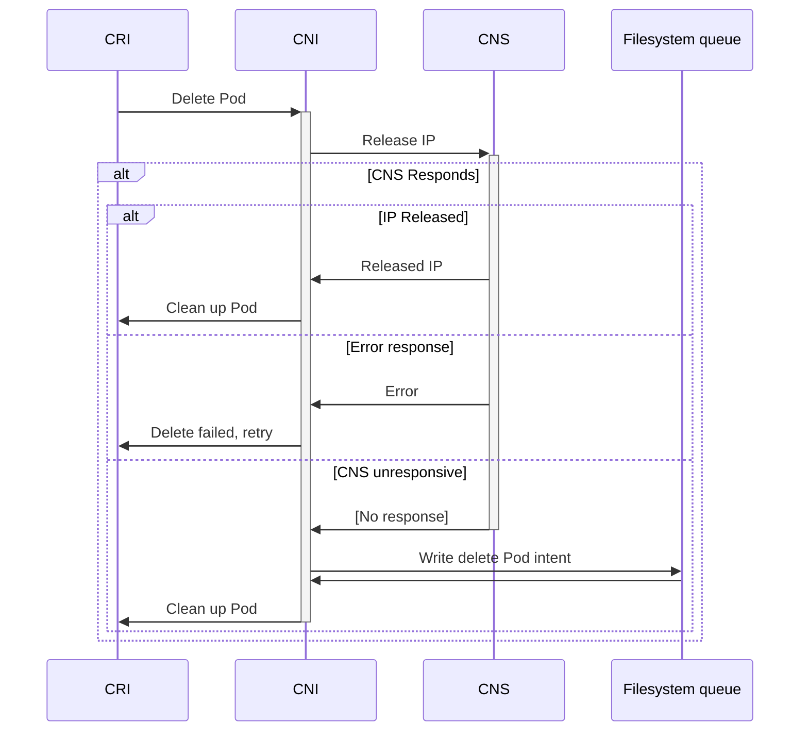

# CNI Async Delete 

```mermaid
sequenceDiagram
    participant CRI
    participant CNI
    participant CNS
    CRI->>+CNI: Delete Pod
    CNI->>+CNS: Release IP
    alt CNS Responds
    alt IP Released
    CNS->>CNI: Released IP
    CNI->>CRI: Clean up Pod
    else Error response
    CNS->>CNI: Error
    CNI->>CRI: Delete failed, retry
    else CNS unresponsive
    CNS->>-CNI: [No response]
    CNI->>Filesystem queue: Write delete Pod intent
    Filesystem queue->>CNI: 
    CNI->>-CRI: Clean up Pod
    end
    end
```
