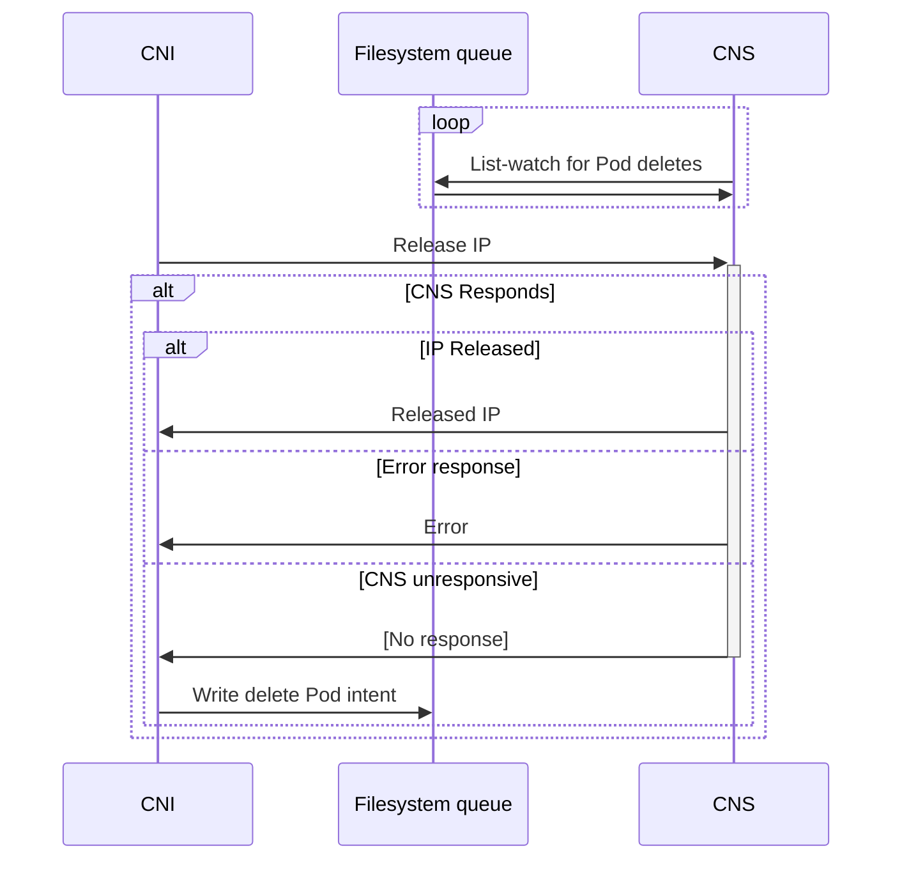
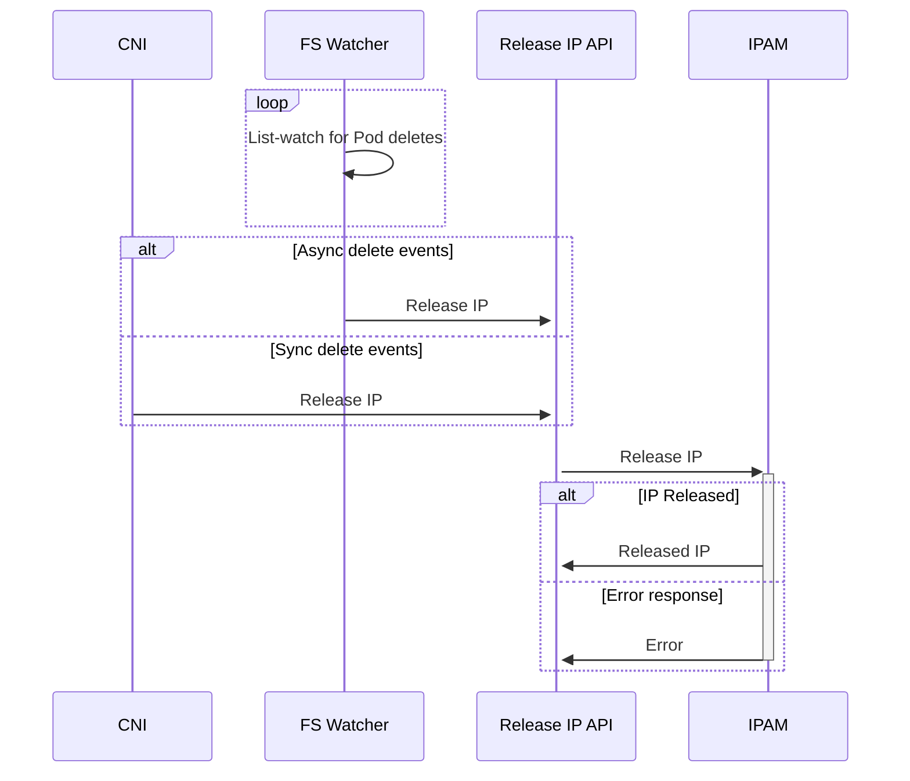

# CNS Async Delete

#### Components 

```mermaid
sequenceDiagram
    participant CNI
    participant Filesystem queue
    participant CNS
    loop
    CNS->>Filesystem queue: List-watch for Pod deletes
    Filesystem queue->>CNS: 
    end
    CNI->>+CNS: Release IP
    alt CNS Responds
    alt IP Released
    CNS->>CNI: Released IP
    else Error response
    CNS->>CNI: Error
    else CNS unresponsive
    CNS->>-CNI: [No response]
    CNI->>Filesystem queue: Write delete Pod intent
    end
    end
```

#### CNS Internals

```mermaid
sequenceDiagram
    participant CNI
    participant FS Watcher
    participant Release IP API
    participant IPAM
    loop
    FS Watcher->>FS Watcher: List-watch for Pod deletes
    end
    alt Async delete events
    FS Watcher->>+Release IP API: Release IP
    else Sync delete events
    CNI->>Release IP API: Release IP
    end
    Release IP API->>+IPAM: Release IP
    alt IP Released
    IPAM->>Release IP API: Released IP
    else Error response
    IPAM->>-Release IP API: Error
    end

```
