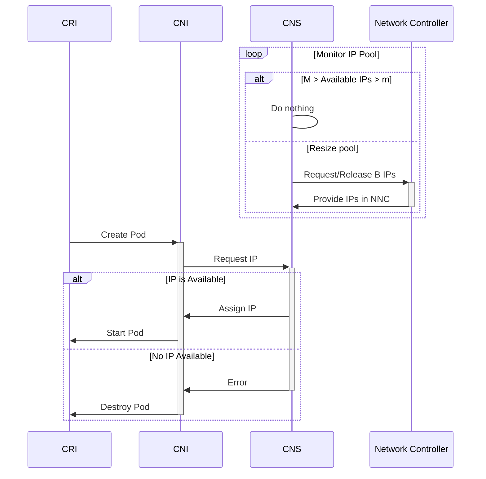

## CNS IPAM redesign

### Background
In SWIFT, IPs are allocated to Nodes in batches $B$ according to the request for Pod IPs on that Node. CNS runs on the Node and handles the IPAM for that Node. As Pods are scheduled, the CNI requests IPs from CNS. CNS assigns IPs from its allocated IP Pool, and dynamically scales the pool according to utilization as follows:
- If the unassigned IPs in the Pool falls below a threshold ( $m$ , the minimum free IPs), CNS requests a batch of IPs from DNC-RC.
- If the unassigned IPs in the Pool exceeds a threshold ( $M$ , the maximum free IPs), CNS releases a batch of IPs back to the subnet.

The minimum and maximum free IPs are calculated using a fraction of the Batch size. The minimum free IP quantity is the minimum free fraction ( $mf$ ) of the batch size, and the maximum free IP quantity is the maximum free fraction ( $Mf$ ) of the batch size. For convergent scaling behavior, the maximum free fraction must be greater than 1 + the minimum free fraction.

Therefore the scaling thresholds $m$ and $M$ can be described by:

$$
m = mf \times B \text{ , } M = Mf \times B \text{ , and } Mf = mf + 1
$$

Typically in current deployments the Batch size $B = 16$ and the minimum free fraction $mf = 0.5$, so the minimum free IPs $m = 8$. The maximum free fraction $Mf = 1.5$ and the maximum free IPs $M = 24$ .

### Scaling

The current Pod IP allocation flows as follows:
- CNS is allocated a Batch of IPs via the NNC and records them internally as "Available"
- As Pods are scheduled on the Node:
    - The CNI make an IP assignment request to CNS.
    - If there is an Available IP:
        - CNS assigns an Available IP out of the Pool to that Pod.
    - If there is not an Available IP:
        - CNS returns an error
        - CRI tears down the Pod Sandbox
- In parallel, CNS monitors the IP Pool as described in the [Background](#background) section above.
    - If the number of Free IPs crosses $Mf$ or $mf$ CNS requests or releases a Batch of IPs via the `NodeNetworkConfig` CRD.

$$m = mf \times B \quad \text{the Minimum Free IPs}$$
$$\text{if } Available IPs \lt m \quad \text{request an additional Batch }B$$

---

### Issues
The existing IP Pool scaling behavior in CNS is reactive and serial.

CNS will only request to increase or decrease its Pool size by a single batch at a time. It reacts to the IP usage, attempting to adjust the Pool size to stay between the minimum and maximum free IPs, but it will only step the pool size by a single Batch at a time. CNS is unable to proactively scale the pool to meet large swings in IP usage (any change in Pod count $\Delta N > B/2$) and will take several round-trips through the NNC to scale the pool to meet the new demand.

This design is also prone to error: because we scale up/down a batch at a time, we have to recalculate IP usage using "future" expected Free IP counts, whenever the Pool size has been updated but the new IP list has not propogated through the NNC. This has lead to IP leaks, or to CNS getting stuck and being unable to scale up the pool because IPs are still in the process of being allocated or released.

Because the "next" request is based on the "current" request, it is possible for the Pool to become misaligned to the Batch size if the Request is edited out of band.
