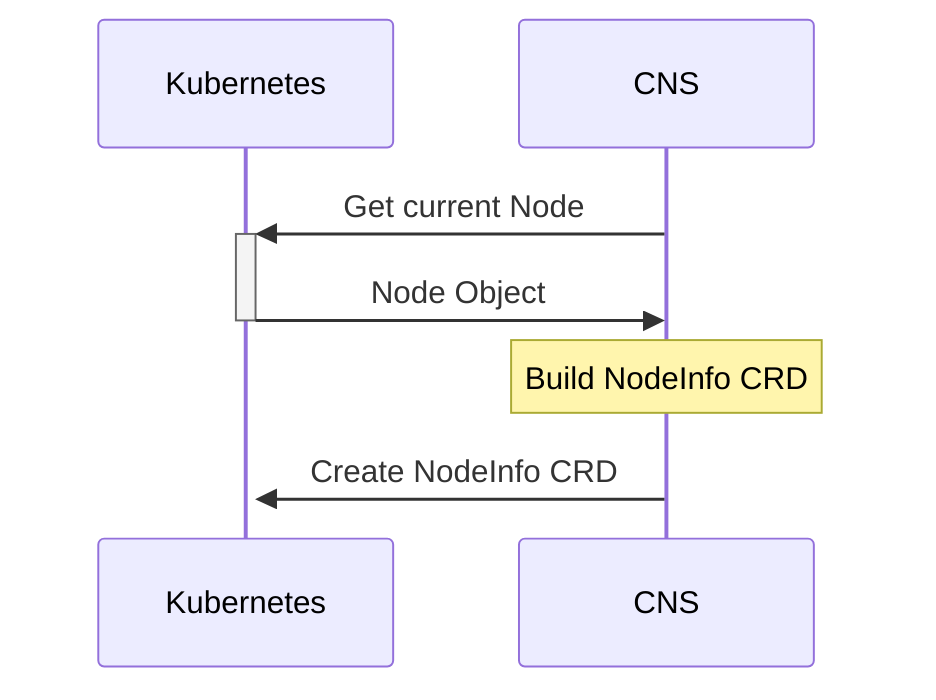
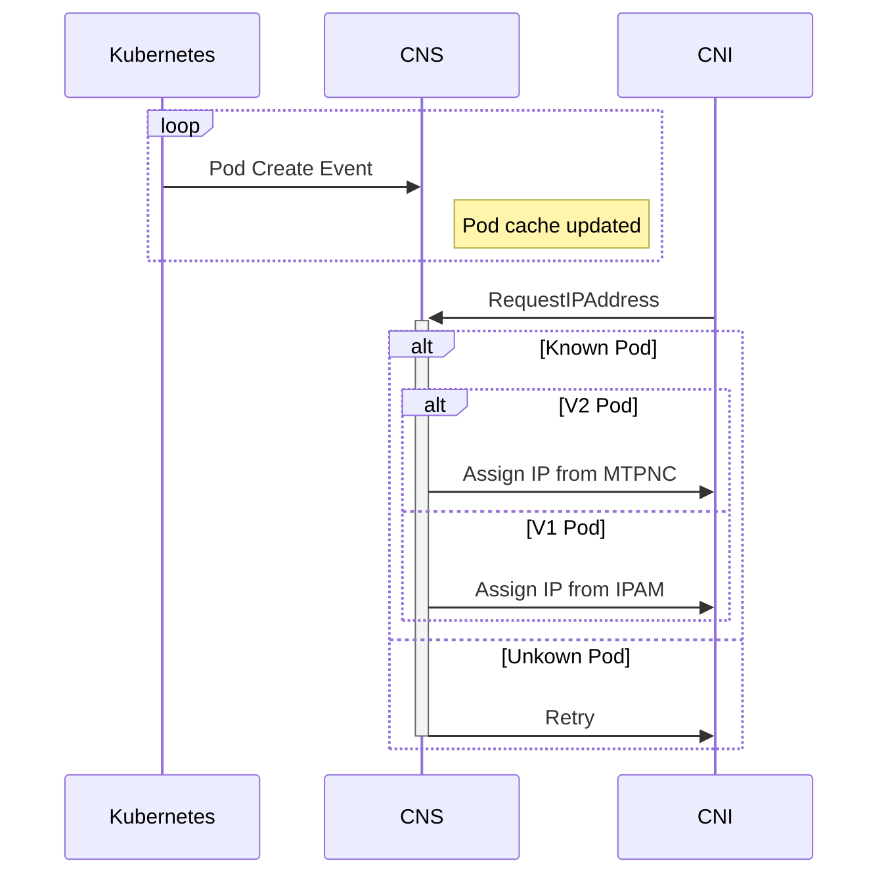

# Swift V2 CNS implementation 

## Introduction
Swift V2 is a multitenant scenario where CNS handles IPAM for both a host cluster (2P subnet) and CX Pods (3P subnet). The CX pods are are networked via secondary NICs and CNS IPAM maps those interfaces to those pods. CNI queries CNS during CX netns bring-up and is told which interface to inject in to the CX pod.

The control boundaries for CNS are its CRDs and IPAM API which the CNI communicates over.
CRDs are:
- PodNetwork (represents a subnet delegation/registration)
- PodNetworkInstance (represents a reservation set)
- NodeInfo  (used to pass VM Unique ID from CNS to DNC-RC)
- MultiTenantPodNetworkConfig  (represents a NetworkContainer)

The IPAM APIs are:
- requestIPAddress
- releaseIPAddress

#### Requirements/Notes
- CNS must run with ManagedEndpointState in the MTv2 Scenario.  
- CNS must wait until the MT interface is programmed before responding to CNI requests with the MT interface IP.  


### Implementation 

#### NodeInfo

At startup, CNS will detect that it is running in V2 mode based on Node labels.

CNS will check for the existence of the `NodeInfo` CRD and will create an instance of a `NodeInfo` associated with its current Node. This CRD is used to pass the VM Unique ID from CNS to DNC-RC. The CRD will have an OwnerReference set to the Kubernetes Node object, so that it is automatically GC'd when the Node is deleted.




```yaml
apiVersion: acn.azure.com/v1alpha1
kind: NodeInfo
metadata:
    name: <node-name>
    ownerReferences:
    - apiVersion: v1
      blockOwnerDeletion: false
      kind: Node
      name: <node-name>
      uid: <node-uid>
status:
    vmUniqueID: <vm-unique-id>
```

#### Pod Network

CNS will watch Pods on its Node via controller-runtime. Controller-runtime will locally cache all known Pods and CNS will simply `GET` using a cache-aware client to read the latest Pod state.

 When it receives an IP Request for a Pod, it will look up the Pod to determine if it is a V2 Multitenant Pod. If it is, CNS will cross-reference the Pod with a MultiTenantPodNetworkConfig (waiting for the controlplane to create the MTPNC if necessary).


```yaml
apiVersion: acn.azure.com/v1alpha1
kind: MultiTenantPodNetworkConfig
metadata:
    name: <pod-name>
    namespace: <pod-namespace>
    ownerReferences:
    - apiVersion: v1
      controller: true
      kind: Pod
      name: <pod-name>
      uid: <pod-uid>
spec:
    podNetwork: <podnetwork-name>
    [podNetworkInstance: <podnetworkinstance-name>]
status:
    uuid: <uuid>
    primaryIP: <primary-ip>
    macAddress: <mac-address>
    status: [provisioned]
```


<details>
<summary>PodWatcher Example Implementation</summary>

```go
package podwatcher

import (
	"context"

	"github.com/pkg/errors"
	v1 "k8s.io/api/core/v1"
	"k8s.io/apimachinery/pkg/fields"
	ctrl "sigs.k8s.io/controller-runtime"
	"sigs.k8s.io/controller-runtime/pkg/client"
	"sigs.k8s.io/controller-runtime/pkg/event"
	"sigs.k8s.io/controller-runtime/pkg/predicate"
	"sigs.k8s.io/controller-runtime/pkg/reconcile"
)

type podcli interface {
	List(ctx context.Context, list client.ObjectList, opts ...client.ListOption) error
}

type podWatcher struct {
	cli     podcli
	sink    chan<- []v1.Pod
	listOpt client.ListOption
}

func New(nodename string, podsink chan<- []v1.Pod) *podWatcher { 
	return &podWatcher{
		sink:    podsink,
		listOpt: &client.ListOptions{FieldSelector: fields.SelectorFromSet(fields.Set{"spec.nodeName": nodename})},
	}
}

func (p *podWatcher) Reconcile(ctx context.Context, req reconcile.Request) (reconcile.Result, error) {
	podList := &v1.PodList{}
	if err := p.cli.List(ctx, podList, p.listOpt); err != nil {
		return reconcile.Result{}, errors.Wrap(err, "failed to list pods")
	}
	p.sink <- podList.Items
	return reconcile.Result{}, nil
}

// SetupWithManager Sets up the reconciler with a new manager.
func (p *podWatcher) SetupWithManager(mgr ctrl.Manager) error {
	p.cli = mgr.GetClient()
	err := ctrl.NewControllerManagedBy(mgr).
		For(&v1.Pod{}).
		WithEventFilter(predicate.Funcs{
			// ignore Status only changes - they don't update the generation
			UpdateFunc: func(ue event.UpdateEvent) bool {
				return ue.ObjectOld.GetGeneration() != ue.ObjectNew.GetGeneration()
			},
		}).
		Complete(p)
	if err != nil {
		return errors.Wrap(err, "failed to set up pod watcher with manager")
	}
	return nil
}
```

</details>

#### Changes to RequestIPAddress

CNS needs context about the Pod (labels) to be able to make IPAM decisions when a RequestIPAddress call is receieved.

The RequestIPAddress handler chain will be modified so that the Request is enriched as it comes in based on cached Pod data. If the Request is for a V2 Pod, the Response will contain the IP assignment from the MTPNC. If the Request is for an infrastructure Pod, it will be handled by the normal IPAM flow. If the request is for an unknown Pod (not in cache), we will return an error and let the CNI retry.




<details>
<summary>HTTPRestService</summary>

```diff
+type IPConfigValidator func(ipConfigsRequest cns.IPConfigsRequest) (cns.PodInfo, types.ResponseCode, string)

type HTTPRestService struct {
	*cns.Service
	dockerClient             *dockerclient.Client
	wscli                    interfaceGetter
	ipamClient               *ipamclient.IpamClient
	nma                      nmagentClient
	wsproxy                  wireserverProxy
	homeAzMonitor            *HomeAzMonitor
	networkContainer         *networkcontainers.NetworkContainers
	PodIPIDByPodInterfaceKey map[string][]string                  // PodInterfaceId is key and value is slice of Pod IP (SecondaryIP) uuids.
	PodIPConfigState         map[string]cns.IPConfigurationStatus // Secondary IP ID(uuid) is key
	IPAMPoolMonitor          cns.IPAMPoolMonitor
	routingTable             *routes.RoutingTable
	store                    store.KeyValueStore
	state                    *httpRestServiceState
	podsPendingIPAssignment  *bounded.TimedSet
	sync.RWMutex
	dncPartitionKey         string
	EndpointState           map[string]*EndpointInfo // key : container id
	EndpointStateStore      store.KeyValueStore
	cniConflistGenerator    CNIConflistGenerator
	generateCNIConflistOnce sync.Once
+   ipConfigsValidators		[]IPConfigValidator
+ 	
}
```

</details>


<details>
<summary>requestIPConfigHandlerHelper</summary>

```go 
// requestIPConfigHandlerHelper validates the request, assigns IPs, and returns a response
func (service *HTTPRestService) requestIPConfigHandlerHelper(ipconfigsRequest cns.IPConfigsRequest) (*cns.IPConfigsResponse, error) {
	podInfo, returnCode, returnMessage := service.validateIPConfigsRequest(ipconfigsRequest)
	if returnCode != types.Success {
		return &cns.IPConfigsResponse{
			Response: cns.Response{
				ReturnCode: returnCode,
				Message:    returnMessage,
			},
		}, errors.New("failed to validate ip config request")
	}

	//[...]
}
```

</details>


<details>
<summary> validateIPConfigsRequest </summary>

```go
func (service *HTTPRestService) v2KnownPodValidator(ipConfigsRequest cns.IPConfigsRequest) (cns.PodInfo, types.ResponseCode, string) {
	pod, ok := service.knownPods[ipConfigsRequest.OrchestratorContext.NamespacedName]
	if !ok {
		return UnkownPodError
	}
	return [...]
}


func (service *HTTPRestService) validateIPConfigsRequest(ipConfigsRequest cns.IPConfigsRequest) (cns.PodInfo, types.ResponseCode, string) {
	for v := range service.ipConfigValidators {
		if err := v(ipConfisRequest); err != nil {
			// todo handle error
		}
	}
}
```

</details>
